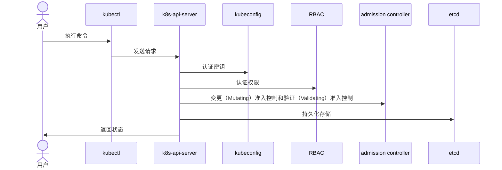

k8s-apiserver 是与 k8s 交互的唯一入口，是一个 RESTFUL API 服务。

## 运行原理

k8s-apiserver 有很多客户端软件，我们最常用的一个客户端软件可能就是 kubectl。当 kubectl 发出一条命令会经过以下以下几个过程：

1. 认证：客户端认证，主要检验 kubeconfig 的密钥是否正确
2. 鉴权：通过 RBAC 进行权限识别
3. admission controller：变更（Mutating）准入控制和验证（Validating）准入控制，其中一些审计工具就是通过变更准入控制和验证准入控制，来判断新创建的资源是否合规
4. 持久化存储：将数据写入 etcd。

